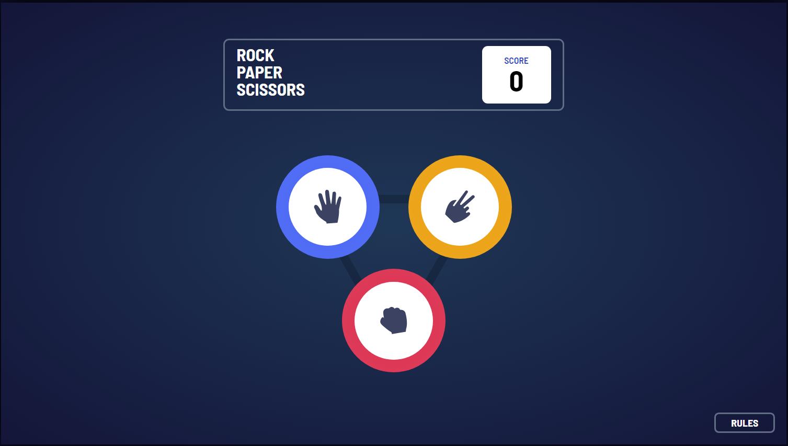
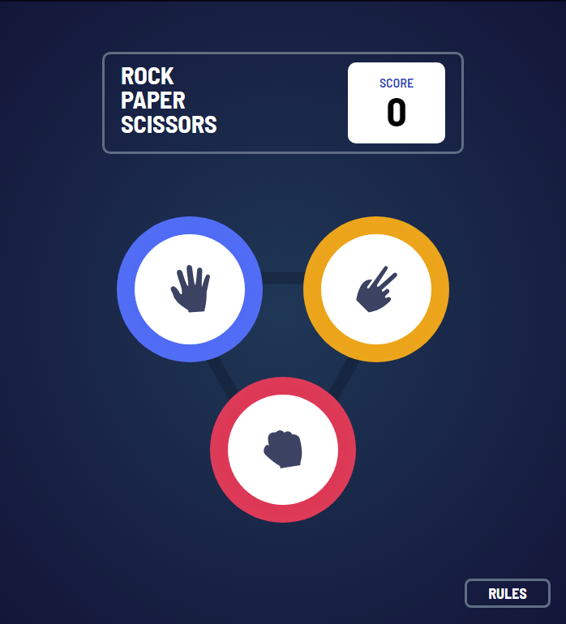
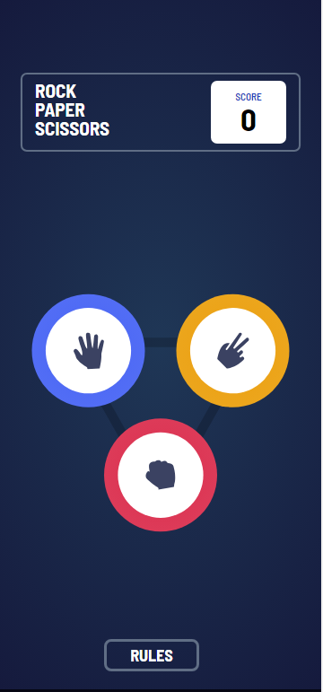

# Frontend Mentor - Rock, Paper, Scissors solution

This is a solution to the [Rock, Paper, Scissors challenge on Frontend Mentor](https://www.frontendmentor.io/challenges/rock-paper-scissors-game-pTgwgvgH). Frontend Mentor challenges help you improve your coding skills by building realistic projects. 

## Table of contents

- [Overview](#overview)
  - [The challenge](#the-challenge)
  - [Screenshot](#screenshot)
  - [Links](#links)
- [My process](#my-process)
  - [Built with](#built-with)
  - [What I learned](#what-i-learned)
  - [Continued development](#continued-development)
- [Author](#author)


## Overview

### The challenge

Users should be able to:

- View the optimal layout for the game depending on their device's screen size
- Play Rock, Paper, Scissors against the computer
- Maintain the state of the score after refreshing the browser _(optional)_
- **Bonus**: Play Rock, Paper, Scissors, Lizard, Spock against the computer _(optional)_

### Screenshot

- 1366px width

- 700px width

- 375px width


### Links

- Live Site URL: [Live Site](alonzo0812.github.io/rps-website/)

## My process

### Built with

- Semantic HTML5 markup
- CSS (Flexbox, Media Queries)
- Native JavaScript methods & DOM manipulation

**Note: These are just examples. Delete this note and replace the list above with your own choices**

### What I learned

I learned a lot of muscle memory with using Javascript DOM methods. But as for problems that I faced, there were three which is the following:

1. Figuring out how to not instantly show the computer's choice. I found that setTimeout was very useful here and I utilized it to delay displaying the computer's answer as well as delay the showing of the play again button and the added brightness to the winner.

```js
switch(choices[compChoice]){
    case "rock":
      setTimeout(function(){
        moveAll(rockDiv,rightChoice)
        rightChoice.style.background = "radial-gradient(hsl(349, 71%, 52%), hsl(349, 70%, 56%))"
      },1500)
      break;
    case "paper":
      setTimeout(function(){
        moveAll(paperDiv,rightChoice);
        rightChoice.style.background = "radial-gradient(hsl(230, 89%, 62%) , hsl(230, 89%, 65%))";
      },1500)
      break;
    case "scissors":
      setTimeout(function(){
        moveAll(scissorsDiv,rightChoice);
        rightChoice.style.background = "radial-gradient(hsl(39, 89%, 49%),hsl(40, 84%, 53%))"
      },1500)
      break;
  }
```


2.  Figuring out how to create new circles on the results screen. I didn't know how to make completely new divs out of scratch and then style them in javascript. There is possibly a way to do so, but I thought to myself that that solution is tedious and instead I opted to just move all the child elements from the game screen to the div at the results screen. This is the bulk of the difficulty of this project and here are two snippets of code that I used.


```js
function moveAll(source, destination) {
  while (source.firstChild) {
    destination.appendChild(source.firstChild);
  }
}
```
(Thanks to the internet for this one)

The other problem when I solved moving the children elements around, was that I cannot move children elements from the rock div in the game screen to both circles on the result screen. This led me to a problem where it would bug when it's a tie so I opted to just make clones of each divs in the game screen.
```js
let rockDiv = rock.cloneNode(true);
let paperDiv = paper.cloneNode(true);
let scissorsDiv = scissors.cloneNode(true);
```

3. This isn't really much of a problem but I did have trouble with media queries wherein all of it is scaling down except for the rules screen. which were easily fixed by changing how the screen works from fixed pixels to a percentage of the main div.

Here is how I used scaling to make my website responsive
```css
@media (min-width: 500px) and (max-width: 780px) {
  #upper-box{
    scale: calc(1);
    
    width: 400px;
  }
  #game{
    scale: calc(1);
  }
  #result{
    scale: calc(.7);
  }
  #rules-screen-div{
    scale: calc(.7);
  }
}
@media (max-width: 500px){
  #upper-box{
    scale: calc(.7);
    width: 400px;
  }
  #game{
    scale: calc(.7);
  }
  #result{
    scale: calc(.4);
  }
  #rules-screen-div{
    scale: calc(.4);
  }
  #rules{
    justify-self: center;
  }
  .attribution{
    font-size: 12px;
  }
}
@media (min-width: 2400px){
  main{
    scale: calc(1.4);
  }
  .attribution{
    font-size: 26px;
  }
}
```


Thank you for reading!

## Author

- Personal Website - [John Leomarc Alonzo](acelmor.com)
- Frontend Mentor - [@alonzo0812](https://www.frontendmentor.io/profile/alonzo0812)


